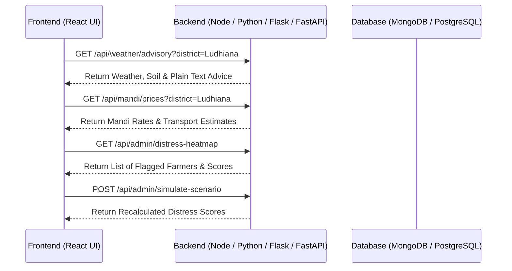

# 🤝 Frontend vs. Backend Responsibility Breakdown & API Contract

Here is the exact task division for your project so you can focus **100% on Frontend UI/UX** while providing clear requirements to your backend team.

---

## 🎨 Part 1: Your Tasks (Frontend Developer Responsibilities)

As the Frontend Developer, you are responsible for the user interface, user experience, responsiveness, and client-side logic:

### 1. Screens & Pages to Build
- **Landing Screen (`App.jsx`)**: Slogan typewriter animation & panel selection buttons (*Farmer Panel* vs *Admin Panel*).
- **Farmer Mobile Panel (`FarmerPanel.jsx`)**:
  - Header with `🌐 Language Switcher` dropdown & `🔊 Voice Advisory` audio player.
  - Hyperlocal Weather & Soil Advisory Card.
  - Live Mandi Price Comparison & Profit Calculator Card.
  - Distress Risk Meter & `🚨 Request Agri-Officer Visit` Red Action Button.
- **Admin Desktop Dashboard (`AdminPanel.jsx`)**:
  - Executive KPI Cards (Total Farmers, Red High-Risk Flags, Weather Deficits, Price Crashes).
  - District Risk Heatmap Table with filter dropdowns and risk status pills (`CRITICAL`, `MODERATE`, `SAFE`).
  - Distress Score Formula Inspector Gauge (Score: **84/100**).
  - Alert Routing Center & Officer Dispatch Modal.
  - **Hackathon Demo Simulator Panel** (Interactive Sliders for judges).

### 2. Client-Side Features & Logic
- **Multilingual Support**: Dictionary file (`translations.js`) supporting English, Hindi, Punjabi, Marathi, etc.
- **Voice Text-to-Speech**: Browser Speech Synthesis API (`window.speechSynthesis`) to read advisories aloud.
- **Profit Calculator**: Formula calculating $\text{Net Profit} = \text{Mandi Price} - \text{Transport Cost}$.
- **Fallback Mock Data (`mockData.js`)**: Structured dummy data so your UI works 100% smoothly even before the backend APIs are deployed!

---

## ⚙️ Part 2: Requirements to Share with Your Backend Team (API Contract)

Copy and share these exact REST API requirements with your backend team so they know what endpoints to create:



### 📋 REST API Endpoints Required from Backend:

#### 1. Weather & Crop Advisory API
* **Endpoint**: `GET /api/weather/advisory`
* **Query Params**: `?district=Ludhiana&lang=hi`
* **Response Payload**:
  ```json
  {
    "temperature": 32,
    "humidity": 70,
    "rainProbability": 70,
    "soilMoisture": 42,
    "npk": { "n": 80, "p": 60, "k": 70 },
    "advisoryText": "Rain expected today. Delay fertilizer application until tomorrow morning."
  }
  ```

#### 2. Mandi Market Prices API
* **Endpoint**: `GET /api/mandi/prices`
* **Query Params**: `?district=Ludhiana`
* **Response Payload**:
  ```json
  [
    { "mandiName": "Local Mandi", "crop": "Wheat", "pricePerQuintal": 2100, "distanceKm": 5, "transportCost": 100 },
    { "mandiName": "District Mandi", "crop": "Wheat", "pricePerQuintal": 2450, "distanceKm": 22, "transportCost": 250 }
  ]
  ```

#### 3. Individual Farmer Distress Status API
* **Endpoint**: `GET /api/distress/farmer/:farmerId`
* **Response Payload**:
  ```json
  {
    "farmerId": "F101",
    "name": "Ramesh Pawar",
    "riskScore": 84,
    "riskLevel": "CRITICAL",
    "loanDueDate": "2026-08-30",
    "loanAmount": 45000,
    "primaryFactors": ["Rainfall Deficit (-38%)", "Market Price Crash (-30%)"]
  }
  ```

#### 4. Request Assistance API (Farmer Action)
* **Endpoint**: `POST /api/distress/request-assistance`
* **Request Body**: `{ "farmerId": "F101", "issue": "Crop Failure & Loan Distress" }`
* **Response Payload**: `{ "success": true, "ticketId": "TCK-9921", "status": "Officer Notified" }`

#### 5. District Distress Heatmap API (Admin Dashboard)
* **Endpoint**: `GET /api/admin/distress-heatmap`
* **Query Params**: `?district=Ludhiana&riskLevel=CRITICAL`
* **Response Payload**:
  ```json
  [
    { "farmerId": "F101", "name": "Ramesh Pawar", "village": "Ludhiana", "riskScore": 95, "factors": "Rainfall Deficit", "status": "CRITICAL" },
    { "farmerId": "F102", "name": "Sunita Deshmukh", "village": "Ludhiana", "riskScore": 82, "factors": "Price Crash", "status": "CRITICAL" }
  ]
  ```

#### 6. Live Hackathon Scenario Simulator API (Judge Tool)
* **Endpoint**: `POST /api/admin/simulate-scenario`
* **Request Body**: `{ "rainfallDeficit": 40, "priceCrash": 35, "loanDueDays": 3 }`
* **Response Payload**:
  ```json
  {
    "recalculatedScore": 92,
    "riskCategory": "CRITICAL",
    "affectedFarmersCount": 128
  }
  ```
