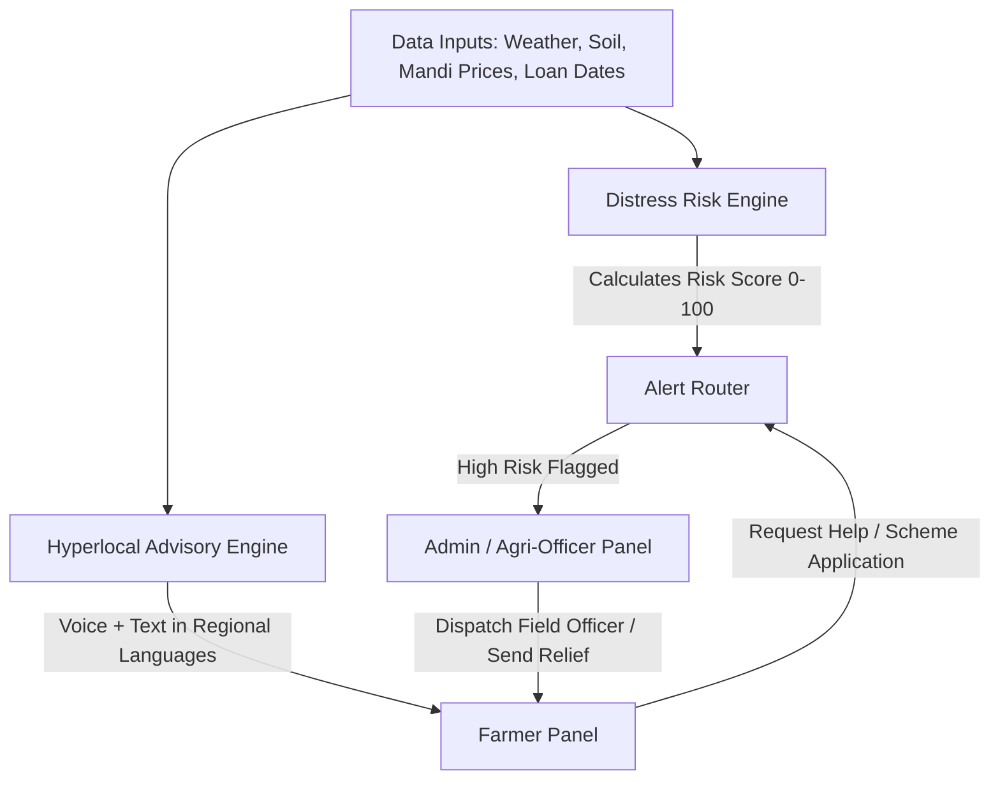

# Implementation Plan: Smart Crop Advisory & Farmer Distress Early-Warning System

Based on your problem statement, the project is divided into two primary connected panels:
1. **Farmer Panel**: A multilingual, low-bandwidth, voice-enabled mobile-friendly interface designed for non-technical farmers.
2. **Admin / Agri-Officer Panel**: A district dashboard with distress-prediction analytics, risk heatmap, alert routing, and scenario simulation for judges/officers.

---

## 🏛️ Architectural Overview & Core Solution Flow



---

## 🌾 Module 1: Farmer Panel (Client Application)

Designed with large touch targets, high-contrast visual cues, multilingual support, and text-to-speech audio narration.

### Key Features & Components:

#### 1. Multilingual & Voice Control Bar
- **Language Switcher**: Instant toggle between English, Hindi (हिंदी), Punjabi (ਪੰਜਾਬੀ), Marathi (मराठी), Tamil (தமிழ்), etc.
- **Voice Narration (Audio Advisory)**: "Listen in your language" button that converts text advisories to speech using Web Speech API or synthesized audio.

#### 2. Hyperlocal Weather & Soil Advisory Card
- **Weather Widget**: Current temp, humidity, 5-day rain forecast, storm alerts.
- **Soil & Crop Health Status**: Nitrogen, Phosphorus, Potassium (NPK) visual bars and moisture level.
- **Plain-Language Actionable Recommendations**: Clear advice like *"Irrigate field tomorrow morning before 10 AM"* or *"High chance of pest outbreak – apply neem oil spray"*.

#### 3. Mandi Market Price Comparison & Profit Maximizer
- **Mandi Comparison Table**: Shows real-time crop prices across nearby Mandis (e.g., Local Mandi vs District Mandi).
- **Net Profit Calculator**: Mandi Price minus estimated transport cost to help farmers choose where to sell.
- **Price Trend Badge**: Warning badge if prices are crashing (*"Price dropped 18% this week"*).

#### 4. Farmer Financial Health & Distress Alert Status
- **Loan & Crop Health Summary**: Shows upcoming loan due dates and insurance status (e.g. PM Fasal Bima).
- **Distress Risk Indicator**: Visual gauge (Green = Safe, Yellow = Advisory needed, Red = Support available).
- **"Request Assistance" Button**: One-tap action for farmers in distress to request an Agri-Officer visit or emergency financial counseling.

---

## 🛡️ Module 2: Admin & Agri-Officer Panel (Dashboard & Alert Router)

Designed for District Agriculture Officers, Govt Administrators, and NGO coordinators to proactively identify distress and deploy assistance.

### Key Features & Components:

#### 1. Executive Distress Monitoring Dashboard
- **KPI Summary Cards**:
  - Total Farmers Monitored
  - High Distress Risk Farmers (Flagged Red)
  - Severe Weather Alert Zones
  - Mandi Price Crash Warnings

#### 2. Interactive District Distress Map (Top Panel View)
- **Interactive Regional Map**: Displays an interactive map of the selected district with color-coded markers for villages/farmer clusters:
  - 🔴 **Red Markers**: High Distress Villages (Rainfall deficit + Price drop + Loan due)
  - 🟡 **Yellow Markers**: Moderate Warning Villages
  - 🟢 **Green Markers**: Safe Zones
- **Marker Interaction**: Clicking any village/farmer pin on the map highlights their record in the heatmap table below and opens a quick summary popup.

#### 3. Admin Jurisdiction & Location Permission Modal (Popup on Access)
- **Login/Access Popup**: When an administrator opens the Admin Panel, a clean modal appears:
  - *"Location & Jurisdiction Access Required: KrishiRakshak Admin Portal requires your current location to load your local district's distress data."*
  - **Action Buttons**:
    - `📍 Grant Location Access` (Triggers browser `navigator.geolocation` to auto-center the map on the officer's current district).
    - `🌐 Use Demo Jurisdiction (Ludhiana / Maharashtra)` (Demo fallback for hackathon presentation).

#### 4. Predictive Distress-Risk Scoring Engine (Core Algorithm UI)
- **Scoring Formula (0 - 100 Risk Index)**:
  $$\text{Distress Score} = w_1 \times \text{Rainfall Deficit} + w_2 \times \text{Price Crash \%} + w_3 \times \text{Loan Due Proximity}$$
- **Live Factor Breakdown**: Displays exact signals triggering high risk for specific farmers or blocks:
  - 🌧️ **Weather Deviation**: Rainfall shortfall > 30% or severe unseasonal rain.
  - 📉 **Market Crash**: Mandi price falling > 25% below Minimum Support Price (MSP).
  - 💳 **Financial Pressure**: Loan due date within 15–30 days paired with crop damage.

#### 3. Alert Routing & Officer Dispatch Action Center
- **High-Risk Farmer Queue**: List of flagged farmers requiring intervention.
- **Officer Assignment**: Assign local extension officers/volunteers to visit high-risk farmers.
- **Action Tracker**: Status workflow (`Flagged` ➔ `Officer Assigned` ➔ `Relief Granted` ➔ `Resolved`).
- **Broadcast Advisory Tool**: Send regional voice/text SMS alerts to all farmers in an affected block.

#### 4. Live Hackathon Simulation Control Panel (Judge Demo Tool)
- **Interactive Data Simulators**: Toggles & sliders for judges to test scenarios live:
  - *Slider 1*: Decrease rainfall by 40% (Simulate Drought)
  - *Slider 2*: Drop Mandi Tomato/Wheat prices by 35% (Simulate Market Crash)
  - *Slider 3*: Shift Loan due dates to "Due in 3 days"
- *Real-time Result*: Demonstrates how the algorithm automatically recalculates distress scores, turns the status RED, and pushes an emergency alert to the Admin Panel instantly!

---

## 📁 Proposed Codebase Structure

```
src/
├── components/
│   ├── common/
│   │   ├── Header.jsx          # Top navigation & Language selector
│   │   └── VoicePlayer.jsx     # Text-to-speech component
│   ├── farmer/
│   │   ├── WeatherAdvisory.jsx # Weather & Soil actionable advice
│   │   ├── MandiPrices.jsx     # Mandi price comparison grid
│   │   ├── FarmerDistressCard.jsx # Personal distress risk summary & help request
│   │   └── CropGuide.jsx       # Regional crop advisories
│   ├── admin/
│   │   ├── AdminDashboard.jsx  # Overview metrics & risk heatmap
│   │   ├── DistressScorer.jsx  # Distress algorithm visualization
│   │   ├── AlertRouter.jsx     # Officer dispatch & task tracking
│   │   └── DemoSimulator.jsx   # Live parameter simulator for judges
├── data/
│   ├── mockFarmers.js          # District-level simulated farmer profiles
│   ├── mockWeather.js          # Rainfall & temperature simulated feeds
│   ├── mockMandi.js            # Mandi crop prices & MSP data
│   └── translations.js         # Multilingual dictionary (EN, HI, PB, MR, TA)
├── utils/
│   ├── distressEngine.js       # Weighted risk score calculation logic
│   └── voiceSynthesizer.js     # Voice speech handler
├── App.jsx                     # Route swapper (Landing / Farmer / Admin)
└── App.css                     # Modern, sleek styling with dark/light themes
```

---

## 🔒 User Review Required

> [!IMPORTANT]
> - The entire dataset (Weather, Mandi Prices, Loan Due Dates, Farmer Profiles) will be backed by structured local mock data designed specifically for a seamless, reliable demonstration.
> - Text-to-speech functionality will use the browser's built-in Web Speech API, with fallbacks for seamless multilingual voice playback.

---

## 🛠️ Verification & Demo Strategy

1. **Farmer Experience Verification**:
   - Switch language to Hindi/Regional ➔ Verify voice readout and advisory updates.
   - Check Mandi price profit calculator.
   - Trigger "Request Officer Visit" ➔ Verify alert reaches Admin panel.
2. **Admin & Judge Demo Verification**:
   - Use the **Demo Simulator Panel** to adjust rainfall deficit and crop price crash.
   - Observe live update of the **Distress Risk Score** (from Green to Red).
   - Route an alert to a local officer and trace its lifecycle to resolution.
